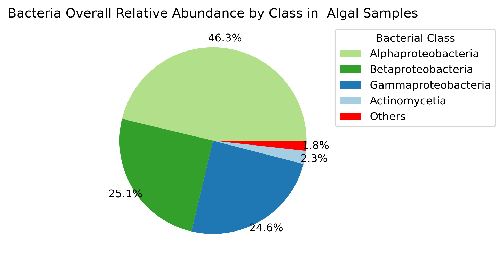
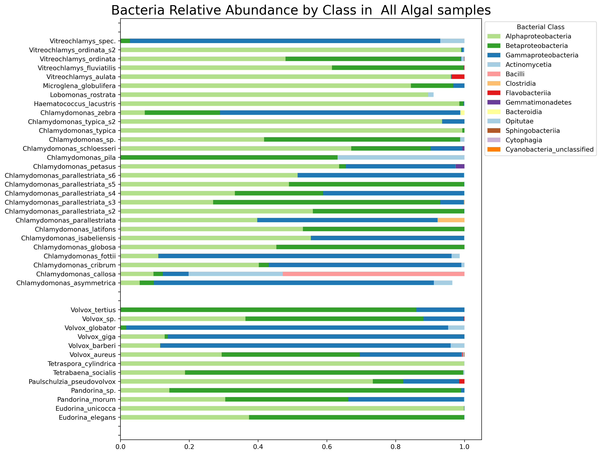
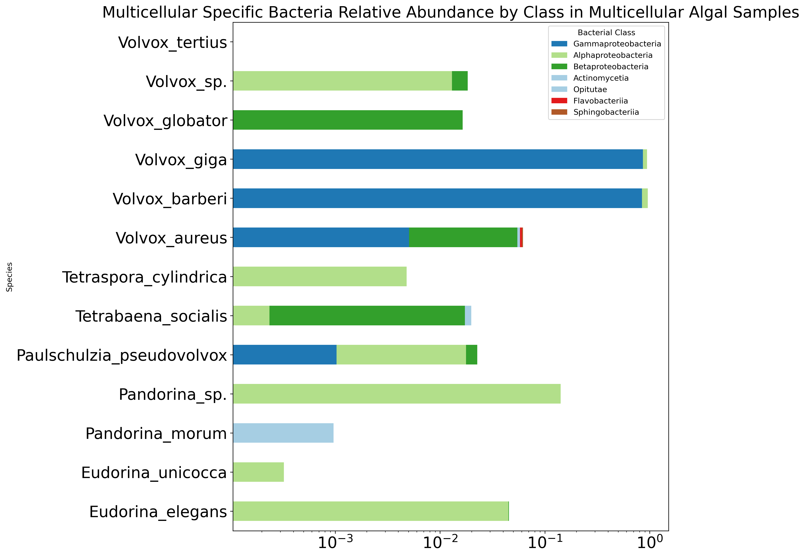

# Metagenomics Analysis of Algal Samples

## Description
This repository contains the following:
- Metagenomics analysis of DNA Samples of algal species with a focus on the bacteria associated with each sample with Metaphlan-Bracken Overlap with 100 as 
number of reads threshold on Bracken (MBO100) method.
- Analysing the bacterial compositions of the samples with a focus on the multicellular/unicellular phenotype of algae.

## Methodology

### Running Metaphlan, Kraken and Bracken on Algal DNA Reads
In this project we had pair-end DNA reads for 41 algal species stored in a directory on UPPMAX. Due to their large size (almost 0.5 TB), we avoided copying the files or changing any names.
The scripts under the directory tools_bash_scripts are a bit specific to these the paths of these files on UPPMAX. Kraken2 was run followed by Bracken. Metaphlan was run also seperately.
The results of each tool was stored in a directory with a name corresponding to the directory name of the sample. So this resulted in 41 directories and under each directory there are 3
directories: kraken, bracken and metaphlan sotrring the corresponding results. The below table shows the resources requested and the time it take to run each tool. Note that, Kraken2
is much faster when the database is loaded to the RAM. It can be run without that but it will be much slower.

| Tool      | # of CPUs |Memory    |Avg Time/Sample|
| --------  | -------   |--------- |---------------|
| Kraken2   | 20        |256GB     |11 mins	   |
| Bracken   | 1         |6.8GB     |0.66 seconds   |
| Metaphlan | 20        |136GB     |30 mins        |

### Obtaining the overlap results (MBO100)

By now for each algal species, we have one directory with 3 folders containing the results of each tool. The script overlap_metaph_bra_batch.sh was run to get the overlapped species detected
in each sample. This script uses the python script analyze_br_meta_overlap.py descripted in metagenomics_tools_comparison.
For each species' directory, an additional folder named overlap contains the overlap results.

### Mapping Overlap Results

In order to aggregate the results of the overlaps in one informative file, the python script map_algae_bacteria.py is used. It outputs a table (or matrix) where the rows are all the microbial
species (all bacteria except for one in our samples) and the columns are all the algal species we have samples for. Additianl columns are there as well for the microbs' taxonomical ids and their lineages.
Att the intersection of the microbial species and the algal species, the overlap average number of reads is reported. Another file with the same is output also with overlap relative abundance instead of the
number of reads.
It is worth mentioning how we define the overlap relative abundance. Braken reports the total number of reads assigned to each species in the sample. Metaphlan reports the estimated number of reads that
were a hit to the marker gene of each species. In our method we first calculate the percentage of reads by each tool for each overlapped species.Then we canclualte the average of that in order to get the Overlap
Relative Abundance (ORA). 
Example: The overlap between Bracken and Metaphlan of a metagenomics sample resulted in two species A and B. Bracken assigned 50 and 100 reads to A & B respectively while metaphlan assigned 10 and 12.
Now the relative abundance of A and B in Bracken will be 0.33 and 0.66. The relative abundances in Metaphlan are 0.45 and 0.55. The Overlap Relative Abundances (ORAs) are 0.39 and 0.605 for A and B.

### Producing Figures 

Finally, the file generated by in the last step of relative abundance can be used with the script analyze_mapping.py to produce some figures. As it can be seen from the 1st figure,the sample of *Chlamydomonas_Callosa* has a very different composition from the remaining. It was found that it had highest abundance of the species *Staphylococcus_aureus* which is a common skin bacteria of humans. Therefore, we interpreted this as a contamination and we decided to drop it from our further analysis.

 
	 
	  
	<em>Fig1. Overall ORA of bacteria species by class level</em>

 
	 
	  
	<em>Fig2. ORA of bacterial species by class in each algal sample</em>

As we can see we could not find any class or lowe taxonomy level of bacteria that is common to all uni or multicellular bacteria. However, we did find a number of 
bacterial species (63 species)that is only present in multicellular bacteria. Every algal species in our samples has at least one of these species except for *Volvox_Tertius*. 100 bacterial species were common to multicellular and unicellular algae and 106 were sepecific to unicellular algae. 

 
	 
	  
	<em>Fig3. ORA of Unicellular specific bacterial species by class.</em>

 
	 
	  
	<em>Fig4. ORA of Unicellular specific bacterial species by class.</em>

