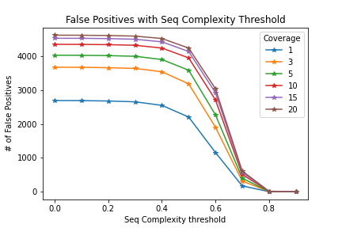
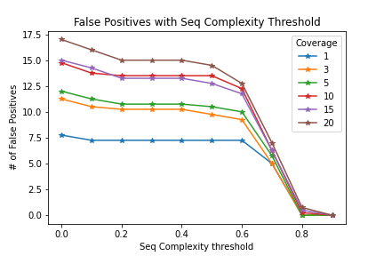
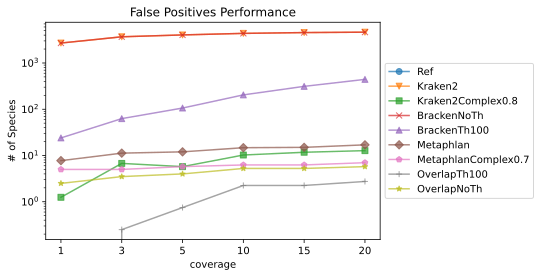
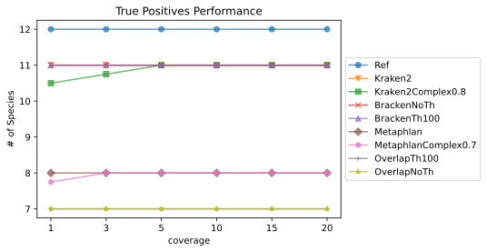
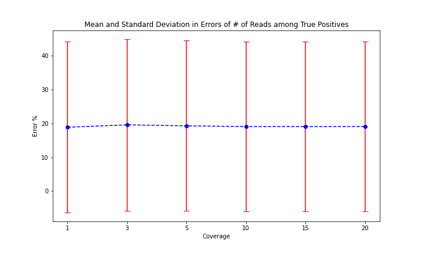

# Metagenomics Analysis Tools Testing and Comparing

## Description
This repository contains the following:
- Method of creating artificial or simulated NGS (Next Generation Sequencing) fasta files from ref genome files with known species compositions. These fasta files emulate sequencing outputs of metagenomic samples. 
- Using Metaphlan and Kracken2, Bracken to perform metagenomics analysis on the artifical fasta files.
- Analysing the performances of the tools in terms of detection with confusion matrix (true and false positives).
- Different methods to enhance further on the tools minimizing false positives by complexity filtering and overlap.

*Note:* 
1. The batch scripts used have headers that are specific to UPPMAX (Uppsala Multidisciplinary Center for Advanced Computational Science). Therefore, make sure that
these headers are not being used when you run the scripts on another cluster or locally.
2. The file steps.txt contains the steps to do these analysis without explaination. 

## Methodology

### Genoms Downloads
12 species were chosen for their genomes to be downloaded. We have selected 2 algal species and 10 bacterial species.
Theses species were selected on the basis that they have a complete reference genome. For the bacterial species, they are from known classes that are associated with algae.
The specific species chosen based on a previous Kraken2 and Metaphlan results that we ran on an actual sample.

The genome fasta files were obtained directly from NCBI Genome database (https://www.ncbi.nlm.nih.gov/genome). Then the NCBI RefSeq assembly fasta file (GCF) was used as a genome.
The species name and its NCBI tax ids are kept as a table in a tsv file seperately. It is important to note that our analysis is on a species level. Therefore, make sure in 
in this table to have species tax id as sometimes the genome you download is for a strain. This is important especially when analysing Kraken2 results.

### Generating Simulated Metagenomics Samples Fasta Files
The fasta files (.fna) of the genomes were then moved all to one directory after naming the files with the species names(make sure the file names do'nt contain any space or dots). 
Then using the script sample_genomes_batch.sh script, artificial metagenomic samples fasta files were generated.

    
        $sbatch sample_genomes_batch.sh <genomes_directory> <read_length> <output_directory> <report_files_prefix>
           
This script uses a python script that produces one fasta file given the genomes, required coverages and read length. The script by default produces coverages of 1,3,5,10,15 and 20. For each
of these coverages 4 random fasta files are generated. More details are provided in the documentation of both scripts under the directory fasta_generation/.
The script produces also a report for each fasta file showing meta data about the composition of the file such as species names, # of reads for each species and their genome size.

### Running Metagenomics Analysis with Kraken, Bracken and Metaphlan

After having the simulated fasta files, they were analyzed using Kraken2 and Metaphlan4.1. The batch scripts under tools_bash_scripts/ were used to run on all the files.
For Kraken2, its PlusPFP database was used built in October 2023 (https://benlangmead.github.io/aws-indexes/k2). For Metaphlan we used its SGB database with the version mpa_vJun23_CHOCOPhlAnSGB_202307.
(https://github.com/biobakery/MetaPhlAn/wiki/MetaPhlAn-4). The output report of Kraken2 was fed to Bracken as well in order to redestribute the number of reads
based on relative abundance then filter out reported species with less than 100 reads. This reduces the false positives of Kraken2(https://ccb.jhu.edu/software/bracken/).
Also, we did another run of bracken without threshold. This will not reduce the false positives by Kraken2 but only redistribute reads. However, this helps collabse the Kraken2 reporting to 
only species level. Kraken2 assigns reads to the deepest taxonomic level possible. So, it is to be noted thatsome of the reads are assigned to strains of some species and we are only 
interested in species level. This is resolved later on.
meta_batch_1.sh produces bowtie files which are then fed to Metaphlan (meta_batch_2.sh)for producing the relative abundance reports. The 1st run produces classified sequence mapping to species.

*Notes:*
	
1. We are interested in the final reports of each tool. The reports provide data about the species that are detected in the samples and estimated # of reads in the fasta file
assigned to each species. This will be enough to analyse the performance of the tools and their overlap compared to actual. 
However, for the enhancement of the results with sequence complexity filtering,we need to get the classified sequences and their assignement. 
This is why we do Kraken2 with 4 outputs for each fasta file and Metaphlan two times with 2 different settings.
2. bowtie files produced by Metaphlan 1st run are stored in the same directory where the fasta files are. It is imortant to move them to a seperate directory.

Att the end of this step we have the following results stored in seperate directories:

	1- Kraken2 metagonimcs analysis results.
	2- Bracken results of the above Kraken2 with one 100 as number of reads per species threshold.
	3- Bracken results of the above Kraken2 with no threshold.	
	4- Metaphlan sequence mapping results.
	5- Metaphlan relative abundance of species results.

### Calculating Sequence Complexities and Filtering Results

To calculate sequence complexities, the tool 'komplexity' was used. It calculates based on k-mer composition (https://github.com/eclarke/komplexity). For Kraken2 results, the fasta
files of the classified sequences that were generated by Kraken2 run were used. This resulted in 24 .tsv files (1 per each classified fasta file) showing the complexity of each sequence
in the file. The purpose of this step is to decide on the threshould of complexity that we should filter on to get best results in terms of false and true positives.
Kraken2 produces a seperate fasta file for the classified sequences and attach the taxonomic id (deepest possible)to the sequence id. 
This is very useful and it is not the case with Metaphlan.

To reach this level with Metaphlan, an extra step is to be done. We need to extract the sequences that were classified by metaphlan. For that the script produce_metaph_class_fastas.py
is used. It takes the ids from the metaphlan_sequences result and the taxid of the species. Use the sequence ids to extract the actual sequence from the original simulated fasta files.
Then combine the sequence id and the tax id as a new sequence id along with the sequence and genarate new fasta files for classified sequences. These new fasta files are stored in the
same direcory metaphlan_sequences. After that, the script meaphlan_komplexity_batch.sh can be run to get tsv files of complexities and stored in a new directory meaphlan_classified_complexity.

By now we have one directory for Kraken2 and one for Metaphlan of classified sequences complexities. Each directory contains 24 files corresponding to the 24 simulated fasta files.

Using, the python script in  analyze_complexity_filtering.py, different complexity thresholds are tested and we can see which one performed best in terms of true and false positives. The following
plot shows false postive counts at different thresholds. The script also produces a tsv with a table showing the numbers of false and true positives at each threshold and coverage.

<figure style="text-align: center;">
	 
	<em> Fig1. Kraken False Positive Results with Complexity Filtering </em>
</figure>

<figure style="text-align: center;">
	 
	<em> Fig2. Metaphlan False Positive Results with Complexity Filtering </em>
</figure>

We can see from the plot that metaphlan performed best in terms of minimum false positive while maintaing true positives at a complexity threshold 0.7 
while Kraken2 at a complexity level 0.8.

### Generating Metaphlan and Bracken Overlap Results

As Metaphlan and Bracken both detect species and estimate the number of assigned reads, we wanted to check the performance if we take their overlap. By overlap, we mean
the species that both Kraken2-Bracken and Metaphlan agree on their existence in the sample. Since we had 2 results groups for Bracken (with 100 sequences as a threshold and without
a threshold), the overlap with Metaphlan can be analyzed twice. The script overlap_metaph_bra_batch.sh can be used for this purpose to do that for all the results at once.
It takes advantage of a python script analyze_br_meta_overlap.py that produce overlap results between a metaphlan results file and a bracken file on a species level. 

## Results 

By now we have performed metagenomics analysis on simulated 24 fasta files with known species compositions in several ways as follows:

	1- Kraken2.
	2- Kraken2 with complexity filtering at 0.8.
	3- Kraken2-Bracken.
	4- Kraken2-Bracken with 100 reads as a threshold.
	5- Metaphlan.
	6- Metaphlan with complexity filtering at 0.7.
	7- Kraken2-Bracken and Metaphlan overlap(3&5).
	8- Kraken2-Bracken with a threshold on bracken and Metaphlan overlap (4&5).

Using the script analyze_tools_performance,py, we can examine the performance of each way above in terms of false positives and true positives. 

<figure style="text-align: center;">
	 
	<em> Fig3. False Positives Performance of Every Method</em>
</figure>

<figure style="text-align: center;">
	 
	<em>Fig4. True Positives Performance of Every Method</em>
</figure>

<figure style="text-align: center;">
	 
	<em> Fig5. Error in # of Reads Assigned</em>
</figure>

We can see the overlap methods provides the best results in terms of # of false positives. In terms of true positives, kraken and bracken are the best with 11 out of 12 species detected. 
The overlap methods provided the least (7 species) limited by metaphlan (8 species) and another species that was not detected with Kraken. 
However, in our research, we are most interested in the bacterial species. So dropping out the two algal species and our overlp detects 7 out of 10 bacterial species (Metaphlan 
does not have the algal species in its database). 

Looking closely at the false species provided by the overlap at a coverage of 20, we found that they were sister species (same genus)
of the missing ones. For example, the overlap missed Pseudomonas Fluorescens but provided Pseudomonas Lurida instead. For the same sample, bracken and metaphlan reported genera that
are false such as Triticum and  Kitasatospora.

Regarding the error of the number of reads assigned to a true species, we can see that the average error (over true species) is around 19% with a large variance. However, the error
does not change with the coverage.

